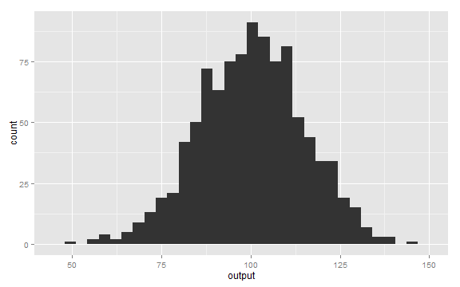
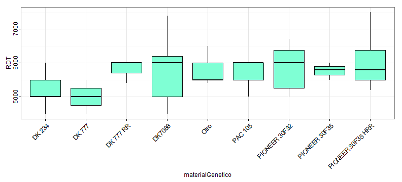

 
## Normal Distribution
 
The normal (or Gaussian) distribution is defined as follows:
 
$$latex
f(x;\mu,\sigma^2) = \frac{1}{\sigma\sqrt{2\pi}} 
e^{ -\frac{1}{2}\left(\frac{x-\mu}{\sigma}\right)^2 }
$$

---
 
## Density Plot
 
To generate random draws from a normal distribution we use the **rnorm** function:
 

```r
output <- rnorm(1000, 100, 15);
```

---
 
## Bell Shape
 
The normal distribution has the typical bell shape:
 

```r
library(ggplot2)
qplot(output)
```

```
## stat_bin: binwidth defaulted to range/30. Use 'binwidth = x' to adjust this.
```



---
 
## Kernel density estimation
 
We can perform density estimation on the sample:
 

```r
plot(density(output))
```



---
 
## Carl Friedrich Gauß
 
This little guy had something to do with it
 

