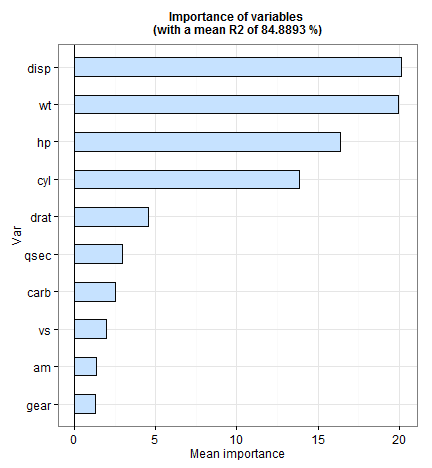

 
## A app to explore data sets with quantitatives targets
 
The application give to the user a tool to identify the relevance of inputs features using the random forest model. Also is possible to explore the variables relations using scatter plots and box plot.
 

---
 
## Select the toyset
 
To start, is necessary choose the database.  There are three possibilities by default: 
 
 
 * corn.db.csv
 * longley.csv
 * mtcasr.csv
 
 
Immediately a database has been selected,  will appear a table with the data below. The function behind is `read.csv`. You can add your own data, only you should save your database in csv format inside to the folder app.

 

---
 
## Bivariate analysis
 
A scatter plot appear when there are two quantitative variable:
 

---
 
## Bivariate analysis
 
A box plot appear when there are one quantitative variable and a qualitative variable:
 

---
 
## Variable Importance Plot
 
You can evaluate the top of relevance variables that explain the output.

